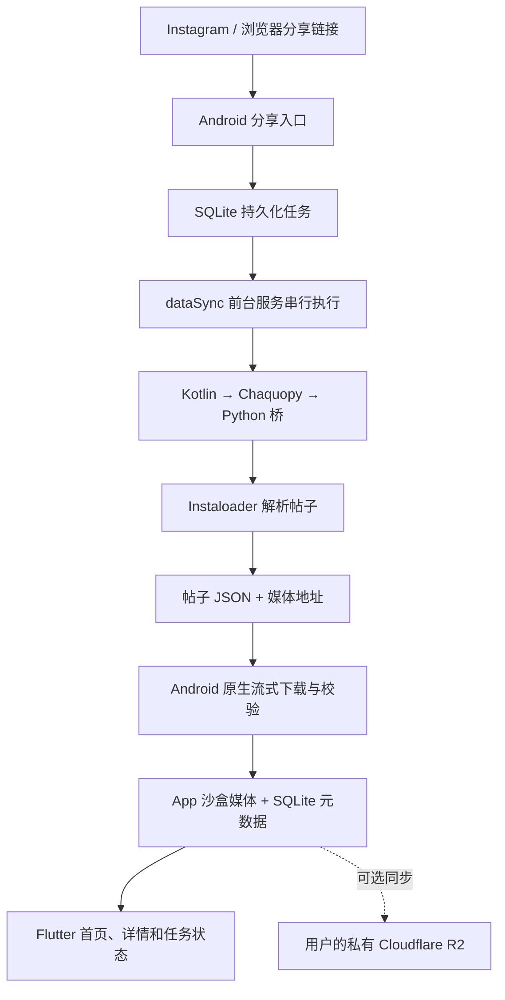

# PhotoBook

PhotoBook 是一个运行在 Android 手机上的 Instagram 帖子归档 App。用户从 Instagram 或浏览器把帖子链接分享到 PhotoBook 后，App 会在手机内解析帖子、下载图片或视频，并保存到本机；整个归档流程不依赖自建服务器。

> PhotoBook 的 Instagram 解析能力主要基于开源项目 [Instaloader](https://github.com/instaloader/instaloader)。项目没有自行重写 Instagram 的数据解析协议，而是通过 Chaquopy 把固定版本的 Instaloader 打包进 Android APK，再围绕它实现移动端任务调度、媒体下载、本地存储、界面和可选的 Cloudflare R2 同步。

## 项目定位

PhotoBook 解决的是“看到一条帖子，分享到手机 App 后长期保存”的问题，而不是在电脑上运行的批量爬取工具。

- 支持公开图片帖、多图帖和 Reel。
- 接收 Android 系统分享，任务进入后台或锁屏后仍由前台服务继续执行。
- 默认只保存在本机，不要求 PhotoBook 账号、设备配对、Worker、D1 或下载服务器。
- 可选配置私有 Cloudflare R2，在多个设备之间同步帖子、预览和原媒体。
- 支持查看、筛选、逻辑删除、保存原媒体和通过 Android 系统面板分享原文件，并可在首页任务列表查看阶段、取消、重试或删除归档任务。
- 使用 Android 默认网络；系统 VPN 是否接管流量由手机系统决定。

当前只归档公开内容。每个帖子先匿名解析；只有 Instagram 明确要求登录时，才会使用用户通过官方 WebView 建立并加密保存在本机的 Session 重试一次。即使当前账号有权查看，私密账号帖子也不会归档。

## 核心依赖：Instaloader

[Instaloader](https://instaloader.github.io/) 是 PhotoBook 获取 Instagram 帖子数据的核心开源项目。PhotoBook 主要复用它完成：

- 根据 shortcode 获取帖子数据。
- 识别图片帖、多图帖和 Reel。
- 读取作者、正文、发布时间、位置及媒体地址等元数据。
- 验证并复用可选的 Instagram 登录 Session。
- 将 Instagram 的异常归类为登录要求、限流、内容不可用或网络错误。

PhotoBook 没有直接采用 Instaloader 默认的命令行下载和目录管理方式。Instaloader 只负责解析，返回结构化 JSON 和媒体地址；实际文件下载、SHA-256 校验、缩略图生成、SQLite 事务和 Android 生命周期管理均由 PhotoBook 完成。

当前 APK 固定使用基于 Instaloader `4.15.2` 的 [hyperplural/instaloader fork](https://github.com/hyperplural/instaloader)，提交为 [`b1d233362e335cbbccba5c5e4b614a1032764118`](https://github.com/hyperplural/instaloader/commit/b1d233362e335cbbccba5c5e4b614a1032764118)。wheel 的来源、提交和 SHA-256 记录在 [`client/android/python/wheels/SOURCE.md`](client/android/python/wheels/SOURCE.md)。Instaloader 使用 MIT License。

## 实现思路

核心原则是让 Instaloader 处理 Instagram 数据解析，让 Android 原生层处理手机上的可靠执行和文件安全，让 Flutter 只负责用户界面。



一次归档按以下顺序执行：

1. `MainActivity` 从 `ACTION_SEND` 中提取并规范化 Instagram 链接，先把任务写入 SQLite，再启动前台服务。即使 Flutter 页面退出，任务也不会只存在于内存。
2. `ArchiveForegroundService` 立即显示通知，并在单线程后台队列中处理任务，避免同时调用 Instaloader。
3. Kotlin 通过 Chaquopy 调用 `photobook_bridge.py`。Python 桥使用 Instaloader 解析 shortcode，并把结果映射成 PhotoBook 约定的 JSON。
4. `MediaPipeline` 使用 Android 网络 API 流式下载媒体。文件先写入 `.part`，同步计算 SHA-256，完成后再原子发布到内容寻址目录，同时生成头像、缩略图和视频元数据。
5. 帖子、媒体、任务完成状态和 R2 outbox 在同一个 SQLite 事务中提交。准备或提交失败时，只回滚本次新增且尚未被引用的文件。
6. 本地归档完成后才尝试 R2 同步。R2 失败不会撤销已经保存的本机帖子，后续由前台服务或 WorkManager 继续恢复。

## 组件分工

| 组件 | 主要职责 |
| --- | --- |
| Instaloader | 解析 Instagram 帖子、作者、媒体列表和可选登录 Session |
| Chaquopy / Python 桥 | 在 APK 内运行 Instaloader，并把 Python 结果转换成稳定的 JSON 协议 |
| Kotlin Android 层 | 分享接收、前台服务、任务恢复、媒体下载、SQLite、Keystore、R2 同步和应用更新 |
| Flutter | 首页、详情、任务列表、Instagram 登录页、R2 设置及状态展示 |
| SQLite | 本机帖子、媒体清单、抓取任务、错误记录和同步状态的权威数据源 |
| Cloudflare R2 | 用户可选的多设备共享资料库，不参与本地归档是否成功的判断 |

## 数据与安全

- 帖子元数据、任务和同步状态保存在本机 SQLite。
- 头像、缩略图和原媒体保存在 App 沙盒，SQLite 只记录路径、大小和 SHA-256。
- Instagram Session 与 R2 Secret 使用 Android Keystore 加密，只保存在当前设备。
- Instagram Session 和 Cookie 不进入 Flutter 状态；R2 Secret 只在用户保存配置时传给原生层，三者都不会写入 SQLite、R2、日志、通知或异常文本。
- R2 使用 SHA-256 内容寻址；删除帖子或媒体时同步逻辑墓碑，不物理删除远端原媒体对象。
- 未配置 R2 时，卸载 App 或清除应用数据会同时删除本机 SQLite 和媒体，无法恢复。


## 项目结构

```text
client/
├── lib/                                  Flutter UI、状态和原生桥接
├── android/app/src/main/kotlin/
│   └── com/mantou/photobook/
│       ├── archive/                      分享、任务、下载、数据库和 R2 同步
│       └── update/                       GitHub Release 更新、校验和安装
├── android/app/src/main/python/          Chaquopy / Instaloader Python 桥
├── android/python/wheels/                固定版本的 Instaloader wheel
└── tool/                                 构建与发布元数据校验脚本

docs/                                     中文架构、构建和运维文档
.github/workflows/release.yml             GitHub Release 发布流程
```

## 使用方式

1. 从 [GitHub Releases](https://github.com/arsenalxj/PhotoBook/releases/latest) 下载并安装适合 `arm64-v8a` Android 手机的最新 APK。
2. 在 Instagram 或浏览器中打开公开帖子，点击“分享”，选择 PhotoBook。
3. PhotoBook 会显示前台通知并在本机完成解析、下载和入库；完成后通知自动消失。
4. 首页右上角任务列表可查看当前阶段，并取消、重试或删除任务记录。
5. 需要提高公开帖解析成功率时，可在设置页通过 Instagram 官方网页建立本机会话。
6. 需要多设备同步时，可在设置页填写自己的 Cloudflare R2 endpoint、bucket、prefix 和对象读写凭证。

## 开发与验证

构建环境需要 Flutter、JDK 17、Android SDK 和 Python 3.13。基础验证命令：

```bash
cd client
flutter pub get
flutter analyze
flutter test
flutter build apk --debug
```

完整的 Python 桥测试、Android 单元测试、lint、ABI 约束和真机检查见 [`docs/deployment.md`](docs/deployment.md)。APK 能成功构建不代表 Instagram 当前仍允许正常解析，正式发布前仍需用真实公开图片帖、多图帖和 Reel 做真机验证。

本机 debug 需要覆盖正式 App 并保留数据时，可在不会提交的 `client/android/local.properties` 中配置仓库外的签名属性文件：

```properties
photobook.signingProperties=/absolute/path/to/key.properties
```

Release 构建必须显式提供正式签名配置：

```bash
cd client
PHOTOBOOK_SIGNING_PROPERTIES=/absolute/path/to/key.properties \
PHOTOBOOK_TARGET_ABIS=arm64-v8a \
  flutter build apk --release
```

签名配置和 Keystore 禁止复制或提交到仓库。正式版本号来自 `client/pubspec.yaml`，版本标签格式固定为 `v<versionName>+<versionCode>`。App 通过公开的 `photobook-update.json` 检查 GitHub Release 更新，只有用户确认后才下载，并在校验大小、SHA-256、包名、版本号和签名证书后交给 Android 系统安装器。

## 进一步阅读

- [`docs/architecture-plan.md`](docs/architecture-plan.md)：完整架构、数据模型、登录和 R2 同步设计。
- [`docs/api.md`](docs/api.md)：Flutter、Kotlin 与 Python 之间的桥接协议。
- [`docs/deployment.md`](docs/deployment.md)：构建、签名、发布和真机验收。
- [`docs/operations.md`](docs/operations.md)：日常使用、故障处理、恢复和清理。

## 说明

PhotoBook 是个人归档工具，与 Instagram、Meta 或 Instaloader 项目没有隶属或官方合作关系。请只归档自己有权访问和保存的内容，并遵守所在地法律、平台条款和内容版权要求。
