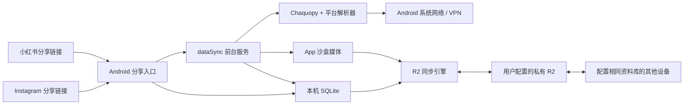
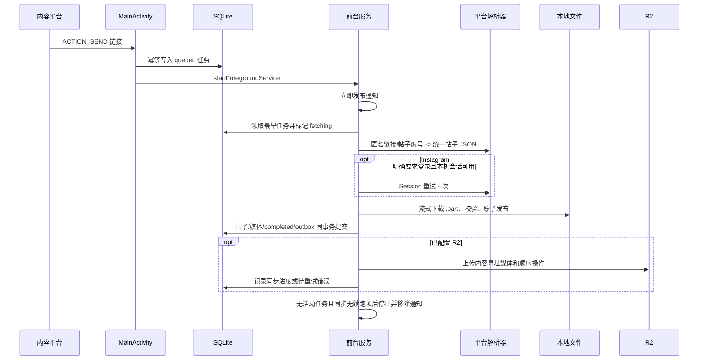

# PhotoBook 纯客户端架构方案

> 状态：客户端实现完成，等待真机验收
> 日期：2026-07-30
> 范围：Android + Instagram/小红书公开帖子，无 PhotoBook 账号，可选 Instagram 本机会话

## 1. 结论

PhotoBook 采用纯客户端架构：Android 前台服务在手机内通过 Chaquopy 调用平台解析器，匿名优先下载媒体并写入本机 SQLite 和 App 沙盒。Instagram 使用固定版本 Instaloader，并可在官方 WebView 建立本机会话；小红书只解析匿名公开页面。Cloudflare R2 是用户自行配置的可选共享资料库，不是本地归档成功的前置条件。

最终不需要 Cloudflare Worker、D1、Python 下载服务器、设备配对、Discord Bot 或 Mihomo。



## 2. 产品边界

首版包含：

- 接收 Instagram 和小红书 `text/plain` 分享。
- 匿名优先抓取 Instagram 公开图片帖、多图帖和 Reel；登录墙出现时可使用已验证的本机会话重试一次。GraphQL 明确返回 `4630001 + Media should not be an HtmlResponse` 时按登录兼容错误处理；登录重试仍失败时，Python 返回结构化阶段，Kotlin 在确认任务未取消后才使用独立 authenticated media-info 调用补齐。其他不可访问错误不得触发 Session。
- 匿名抓取小红书公开图片、视频、原生 GIF 和 Live Photo；不提供小红书登录或验证码绕过。
- 设置页提供 Instagram 官方 WebView 登录、登录状态、重新登录、复制Cookie 和清除会话。复制只允许在会话可用时由用户主动触发。
- App 退到后台或锁屏后继续下载，完成后自动停止前台服务。
- 本地瀑布流、详情、失败重试和按需原媒体读取。
- 可选 R2 上传、拉取、多设备去重同步和逻辑删除。
- 原图、原生 GIF 和原视频可保存到系统相册并通过 Android 系统面板分享；Live Photo 完整态可互斥导出静态图、GIF 或视频。
- 系统 VPN 透明接管网络。

首版不包含：

- PhotoBook 账号、注册、配对或设备吊销。
- 手动 Cookie、Instaloader session 文件、原生账号密码表单或私密帖子。
- 评论、互动数据、Live Photo 转 GIF 之外的通用视频转码、HLS 或 AI 处理。
- Worker、D1、服务端下载器和 Mihomo 控制。
- 物理删除 R2 共享媒体。

匿名访问仍会受到平台登录墙、验证、限流和页面结构变化影响。Instagram 认证重试只处理明确的登录要求；小红书不做认证重试。两者都不能绕过限流或访问控制，也不能宣称可以下载私密或所有公开内容。

## 3. 端到端流程



所有阶段先写持久状态。系统杀进程、网络中断或用户离开 Flutter 页面时，任务都不能只存在内存。R2 分批拉取、预览补齐和读取错误同样必须返回续跑状态，不能只以“本机没有待上传操作”判断同步完成。

## 4. 组件职责

| 组件 | 负责 | 不负责 |
|---|---|---|
| Flutter | 首页、详情、任务列表、Instagram 登录状态与 Cookie 复制命令、R2 设置、检查更新、展示任务状态 | 读取或接收 Cookie 内容、平台抓取、维持后台执行 |
| MainActivity | 接收分享、规范化链接、先落任务、启动服务 | 长时间网络请求 |
| ArchiveForegroundService | 通知、串行调度、恢复、停止条件 | UI 状态 |
| ArchiveRunner | 按平台选择 Python 解析器、原生下载、缩略图、事务提交、一次有界同步 | 保存明文密钥 |
| Chaquopy bridge | 验证 WebView Cookie，调用平台解析器，把帖子映射成统一 JSON | 保存 Session 文件、文件下载、SQLite、R2、ffmpeg |
| SQLite | 本机帖子、媒体、任务、失败和同步状态 | 二进制媒体、Secret |
| R2 | 可选多设备操作日志和内容寻址媒体 | 用户身份、任务协调、查询数据库 |

## 5. 本地数据模型

### `posts` / `post_media`

帖子 ID 固定为 `<source_platform>:<source_post_id>`，媒体 ID 固定为 `<post_id>:<sort_index>`。`source_platform` 当前只允许 `instagram / xiaohongshu`，数据库用 `(source_platform, source_post_id)` 唯一约束隔离平台命名空间。

`post_media.logical_index` 表示详情页中的逻辑媒体序号；`media_role` 只允许 `primary / live_still / live_motion`。普通图片、普通视频和原生 GIF 使用 `primary`；Live Photo 的静态图和动态视频使用相同 `logical_index`，角色分别为 `live_still` 和 `live_motion`。`media_type` 仍只允许 `image / video`，GIF 表示为 `image + image/gif`。`media_count` 是物理文件数，界面逻辑数量按 `logical_index` 去重计算。

本机抓取完成前必须拥有所有不可降级媒体；Live Photo 动态部分允许缺失并保留静态图。云端同步导入的帖子允许原媒体状态为 `remote`。

### `capture_jobs`

- `id`
- `source_url`
- `source_platform`
- `request_key`：解析前任务去重键，短链使用本机保存的完整分享 URL，不进入帖子元数据或 R2
- `source_post_id`：允许在短链解析前为空，解析成功后回填
- `status`：`queued / fetching / downloading / committing / cancelling / completed / failed`
- `progress_current / progress_total`
- `attempt_count`
- `next_attempt_at`
- `error_code / error_message`
- `created_at / updated_at`

同一 `(source_platform, request_key)` 只有一个任务；不同短链即使最终指向同一帖子，也可能各自解析和下载，但最终按 `<source_platform>:<source_post_id>` 覆盖为同一正式帖子。首页任务列表只查询 `queued / fetching / downloading / committing / cancelling / failed`，按“进行中 / 失败 / 已取消”分组，不展示已完成历史，也不混入 R2 同步或应用更新任务。`queued` 且设置了 `next_attempt_at` 时显示“等待自动重试”，下载阶段显示 `progress_current / progress_total`，`cancelling` 显示“正在取消”且不提供取消、重试或删除操作。

排队任务取消时直接改为 `failed + CANCELLED`；运行 attempt 取消时先改为 `cancelling`，执行器停止后续阶段，完成文件回滚和任务临时目录清理，再以相同 `attempt_count` 收口为 `failed + CANCELLED`。进程中断后恢复时也必须把遗留 `cancelling` 收口为已取消，不能重新排队。运行 attempt 的阶段更新、错误写入和最终提交都必须同时校验 `attempt_count` 与期望状态；匿名解析前后、读取 Session 前、认证重试前后、媒体下载循环及流式读取中、提交前都检查任务仍属于当前 attempt。取消后不得继续读取 Session、发起认证请求、保存刷新后的 Session、下载或提交。Chaquopy 的 Instaloader 解析是同步调用，不能强杀正在执行的 Python 网络请求，因此单次网络请求超时固定为 30 秒；请求返回后立即响应取消。

抓取恢复与 R2 同步恢复分别使用 `archive_capture_recovery` 和 `r2_sync_recovery` 两个唯一 WorkManager 计划。取消等待自动重试的排队任务后只重算抓取计划，即使已配置 R2 也不得保留无用的抓取唤醒；R2 重试计划不受影响。若另一个抓取任务正在执行，取消排队任务不得替换或取消当前执行器，执行结束后再按剩余队列重算。删除只允许删除 `failed` 任务记录，不删除已归档帖子、媒体或 R2 数据；活动任务必须先取消。

### `sync_ops`

- `device_id + seq` 联合主键。
- `operation`：只支持 `upsert_post`、`delete_post` 和 `delete_media`。
- `entity_id`、`payload_json`、`created_at`。

### `sync_entity_states`

- `entity_type + entity_id` 标识帖子或媒体。
- `state` 为 `active / deleted`，业务行不存在时仍保留墓碑。
- `version + device_id + seq` 构成确定性实体版本；它与 R2 操作顶层的传输设备和传输 seq 分离。本地逻辑时钟在每次业务写入和远端应用后单调递增，并显式防止 `Long` 溢出。

### `sync_uploads`

- `repository_id + device_id + seq` 联合主键。
- `uploaded_at`、`last_error` 按资料库分别记录，同一操作可迁移到不同资料库。

业务写入和 outbox 必须同事务提交，不能吞掉 outbox 写入错误。

`upsert_post` payload 的帖子必须携带 `sourcePlatform`，每个媒体必须携带 `logicalIndex + mediaRole`。同步操作类型保持不变；GIF 和 Live Photo 都复用内容寻址媒体与现有三种操作。

### 小红书与 Live Photo

小红书只解析匿名可访问的公开分享页。短链逐跳限制为 HTTPS 和 `xhslink.com / xhslink.cn / xiaohongshu.com / rednote.com`，页面解析 `window.__INITIAL_STATE__` 并按最终 URL 的 `note_id` 精确选帖，不接入登录、Cookie、签名接口、私密内容或验证码绕过。含 `xsec_token` 的请求 URL 只保存在抓取任务中；同步帖子只保存不含 query 的 `https://www.xiaohongshu.com/explore/<note_id>`。图片存在 `fileId` 时优先通过对应地域的 `sns-img-*.xhscdn.com` 获取全尺寸无水印 JPEG，H5 详情图只作为不可下载时的兼容回退；没有可信 `fileId` 或无法确定对应原图 CDN 时保留 H5 详情图。媒体下载关闭系统自动跳转，每一跳都重新校验 HTTPS、端口和平台 CDN 域名；原图回退只处理明确的媒体不可下载错误，不得用回退掩盖断网、限流或不安全跳转。

Live Photo 的静态图必须成功，动态视频允许下载失败后静态降级。详情页一个 `logical_index` 只显示一页：默认静态图，完整态长按播放动态、松手恢复；降级态不显示重试入口。右上角保存和删除以逻辑媒体为选择单位并默认全选，不在媒体画面上叠加操作入口。完整态保存和分享提供“静态图 / GIF / 视频”三个互斥选项，批量保存时同一选择应用于所有完整 Live Photo，降级态只使用静态图。转 GIF 固定最长边 720、目标最高 20 FPS、最多 72 帧、最大 50 MB；长视频通过降低实际帧率覆盖完整时长。原生 GIF 保留原文件，详情页自动循环，首页缩略图保持静态。

### `sync_peers`

每个远端 `device_id` 独立保存 `high_water_seq`。只有期望序号成功应用后才能推进。

## 6. 本地文件

```text
files/archive/
  jobs/<job_id>/
  avatars/<sha256>.jpg
  thumbnails/<sha256>.jpg
  originals/<sha256>.<ext>
```

下载先写任务目录或目标旁的 `.part`。完成长度与 SHA-256 校验后原子改名。图片缩略图最长边 800 px、JPEG Q85；视频使用 `MediaMetadataRetriever` 抽帧，不携带 ffmpeg。

## 7. R2 资料库与同步协议

资料库身份：

```text
sha256(normalizedEndpoint + "\n" + bucket + "\n" + normalizedPrefix)
```

Access Key 只代表访问权限，替换 Key 不产生新资料库。每个安装生成随机 `device_id`，清除 App 数据后视为新设备。

```text
<prefix>/
  devices/index/<device_id>.json
  devices/<device_id>/manifest.json
  devices/<device_id>/ops/<20-digit-seq>.json
  media/originals/<sha256>.<ext>
  media/thumbnails/<sha256>.jpg
  media/avatars/<sha256>.jpg
```

同步规则：

1. 本地提交帖子时生成不可变 outbox 操作；上传按固定批次执行，剩余操作交给下一次恢复任务。
2. 先以 `HEAD` 去重并按操作 payload 中的 SHA-256 上传对应媒体，再上传 op 对象。
3. op 上传成功后更新本设备 manifest；同一个 key 不允许覆盖不同内容。
4. 拉取先列出 `devices/index/`，再读取各设备 manifest。
5. 从 `high_water_seq + 1` 顺序读取；缺失时停止该设备，不跳号。
6. 远端 upsert 或 delete 原子写入 SQLite 和实体状态；墓碑压住旧 upsert，更新版本的重新归档可以恢复。
7. 云同步错误只保留 pending/error，不改变本地 `completed`。
8. 每批仍有远端操作或预览未补齐时立即安排下一批；读取失败时使用 WorkManager 退避重试，并把错误展示给用户。
9. 切换 endpoint、bucket 或 prefix 时，为当前 active 帖子和 deleted 帖子/媒体墓碑追加完整快照。快照分配新的传输 seq，但保留实体原始版本，不能因此改变冲突胜者。迁移期间保留上一个资料库的加密配置，用它补回本机尚未缓存的原媒体；迁移成功后清除旧配置。

帖子和媒体删除只移除当前资料库可见状态，并追加不可变操作；R2 原始媒体、缩略图、头像和历史操作长期保留。详情页批量删除必须先校验整批选择并在一个 SQLite 事务内提交：全选使用 `delete_post`，部分选择按 `logical_index` 删除并为 Live Photo 组内静态图和动态视频分别写 `delete_media`。详情页保存到系统相册产生独立副本，批量保存逐项执行并汇总部分失败；后续从 PhotoBook 删除不会影响相册。

项目处于开发阶段，不维护本机数据库升级或 R2 格式兼容。结构或同步格式变化后，卸载 App 并清空对应 R2 prefix，新的本机数据库和操作流从空状态开始。

R2 使用 S3 API 的 `region=auto`。凭证仅存 Keystore，token 权限限制到目标 bucket 的对象读写。分页必须依据服务返回的截断标记，不能按返回数量猜测结束。

Instagram Session 使用独立 Keystore 密钥加密，不写 SQLite 或 R2。账号密码只提交给官方 WebView；Android `CookieManager` 取得 Cookie 后由 Chaquopy 验证，成功才替换旧会话并清理 WebView 数据。用户只能在 `ready` 状态主动命令 Android 原生层把 Cookie Header 写入系统剪贴板；Cookie 不经过 Flutter MethodChannel 返回值，剪贴板标记敏感内容，并在进程存活时 60 秒后仅清理未被替换的该份内容。匿名成功时不解密 Session；认证失败只标记会话需要刷新，不影响已经完成的本地归档。

## 8. Android 生命周期

- Manifest 声明 `FOREGROUND_SERVICE`、`FOREGROUND_SERVICE_DATA_SYNC` 和 `POST_NOTIFICATIONS`。
- Service 声明 `android:foregroundServiceType="dataSync"`、`exported=false`。
- Service 启动后先 `startForeground`，再冷启动 Python。
- 恢复 Worker 占用执行权时，由用户分享启动的前台服务保持运行并等待，获得执行权后立即扫描持久任务。
- Android 15 起后台 `dataSync` 前台服务有系统累计时长限制；超时时保存状态并停止。
- 用户从系统“活动应用”停止 App 会直接终止进程，无法承诺自动恢复；下次用户启动 App 后继续持久任务。
- WorkManager 在网络恢复、重启或进程重建后扫描未完成任务，但不替代分享时的直接前台服务；抓取恢复与 R2 同步恢复独立调度，并通过同一执行权串行运行。
- 已配置 R2 时，App 冷启动和回前台都会触发一次同步；同步完成、续跑和失败状态由原生层事件驱动 Flutter 反馈。

## 9. 验收边界

源码仓库已完成纯客户端迁移，只保留 Android 客户端和现行文档。发布前仍需在 arm64 真机完成图片帖、多图帖、Reel、Instagram 普通登录与 2FA、匿名优先与 Session 回退、后台/锁屏下载、异常恢复和双设备 R2 同步验收；构建通过不能替代这些真实网络与生命周期验证。

## 10. 应用内更新

PhotoBook 冷启动后直接读取 Public GitHub Release 的稳定更新清单。检查不阻塞归档和 R2 同步；自动检查失败不打扰用户，设置页手动检查必须反馈结果。发现更高 `versionCode` 后先展示版本与说明，用户确认才开始下载。

APK 下载到缓存目录并经过大小、SHA-256、`com.mantou.photobook` 包名、更高整数版本号和当前 App 证书校验。通过后交给 Android `PackageInstaller`，未知来源权限由系统设置页处理，不提供静默安装。更新分发不使用 Worker、R2 或 Actions Artifact。
