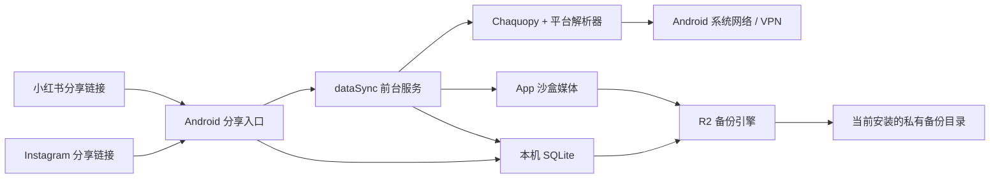
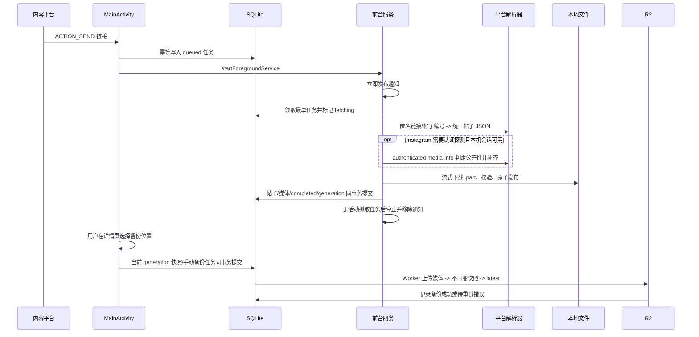

# PhotoBook 纯客户端架构方案

> 状态：手动单向备份重构中
> 日期：2026-08-11
> 范围：Android + Instagram/小红书公开帖子，无 PhotoBook 账号，可选 Instagram 本机会话

## 1. 结论

PhotoBook 采用纯客户端架构：Android 前台服务在手机内通过 Chaquopy 调用平台解析器，匿名优先下载媒体并写入本机 SQLite 和 App 沙盒。Instagram 使用固定版本 Instaloader，并可通过官方 WebView 或手动 Cookie 建立本机会话；小红书只解析匿名公开页面。Cloudflare R2 是用户自行配置、按安装实例隔离的可选单向备份目标，不是本地归档成功的前置条件，也不是跨设备同步源。

最终不需要 Cloudflare Worker、D1、Python 下载服务器、设备配对、Discord Bot 或 Mihomo。



## 2. 产品边界

首版包含：

- 接收 Instagram 和小红书 `text/plain` 分享。
- 匿名优先抓取 Instagram 公开图片帖、多图帖和 Reel。抓取结果按成功、可重试失败、需要认证探测、确定失败和不支持的新响应五类决策处理；任务取消独立于抓取决策。匿名元数据返回结构有效的 GraphQL envelope，但只有 `data=null + 非空对象 errors` 时视为访问状态不确定，不依赖具体错误码或字段组合，也不再额外请求匿名 permalink。Kotlin 在确认任务未取消后，有 `ready` Session 时最多调用一次 authenticated media-info：公开账号帖子继续归档，私密账号帖子明确拒绝，空结果记为登录后仍不可访问；没有 Session 时提示登录以确认帖子状态。断网、超时、429 和 5xx 自动重试；明确 404 直接失败；畸形 envelope、未知帖子字段或 media-info 结构返回 `UNSUPPORTED_RESPONSE`，不得误判帖子不存在或触发 Session。
- 匿名抓取小红书公开图片、视频、原生 GIF 和 Live Photo；不提供小红书登录或验证码绕过。
- 设置页提供 Instagram 官方 WebView 登录、手动 Cookie 登录、登录状态、重新登录、复制Cookie 和清除会话。复制只允许在会话可用时由用户主动触发。
- App 退到后台或锁屏后继续下载，完成后自动停止前台服务。
- 本地瀑布流、详情、失败重试和按需原媒体读取。
- 可选 R2 手动单向备份、失败重试和同一安装按需恢复缺失原媒体；同一 bucket 可配置多个 prefix，也可增加其他 bucket。
- 原图、原生 GIF 和原视频可保存到系统相册并通过 Android 系统面板分享；Live Photo 完整态可互斥导出静态图、GIF 或视频。
- 系统 VPN 透明接管网络。

首版不包含：

- PhotoBook 账号、注册、配对或设备吊销。
- Instaloader session 文件、原生账号密码表单或私密帖子。
- 评论、互动数据、Live Photo 转 GIF 之外的通用视频转码、HLS 或 AI 处理。
- Worker、D1、服务端下载器和 Mihomo 控制。
- 从 R2 拉取帖子元数据、跨设备同步、设备发现或物理删除 R2 媒体。

匿名访问仍会受到平台登录墙、验证、限流和页面结构变化影响。Instagram 认证探测只处理结构有效但访问状态不确定的响应，最多使用 Session 一次；无法理解的新结构明确要求更新客户端。小红书不做认证重试。两者都不能绕过限流或访问控制，也不能宣称可以下载私密或所有公开内容。

## 3. 端到端流程



所有阶段先写持久状态。系统杀进程、网络中断或用户离开 Flutter 页面时，任务都不能只存在内存。只有详情页手动操作会创建备份任务；任务创建后按目标和固定批次串行上传，失败任务由 WorkManager 续跑。备份引擎不列举远端帖子或设备，不从 R2 导入本机数据。

## 4. 组件职责

| 组件 | 负责 | 不负责 |
|---|---|---|
| Flutter | 首页、详情、任务列表、Instagram 登录状态、手动 Cookie 瞬时输入与复制命令、R2 连接/位置设置、发起手动备份、检查更新、展示任务状态 | 读取已保存 Cookie 或 R2 Secret、持久化凭证、平台抓取、维持后台执行 |
| MainActivity | 接收分享、规范化链接、先落任务、启动服务 | 长时间网络请求 |
| ArchiveForegroundService | 通知、串行调度、恢复、停止条件 | UI 状态 |
| ArchiveRunner | 按平台选择 Python 解析器、原生下载、缩略图和本地事务提交 | 创建或执行 R2 备份、保存明文密钥 |
| Chaquopy bridge | 验证 WebView 或手动 Cookie，调用平台解析器，把帖子映射成统一 JSON | 保存 Session 文件、文件下载、SQLite、R2、ffmpeg |
| SQLite | 本机帖子、媒体、任务、失败和备份状态 | 二进制媒体、Secret |
| R2 | 当前安装的不可变帖子快照和内容寻址媒体 | 本机数据源、跨设备同步、任务协调、查询数据库 |

## 5. 本地数据模型

### `posts` / `post_media`

帖子 ID 固定为 `<source_platform>:<source_post_id>`，媒体 ID 固定为 `<post_id>:<sort_index>`。`source_platform` 当前只允许 `instagram / xiaohongshu`，数据库用 `(source_platform, source_post_id)` 唯一约束隔离平台命名空间。

`post_media.logical_index` 表示详情页中的逻辑媒体序号；`media_role` 只允许 `primary / live_still / live_motion`。普通图片、普通视频和原生 GIF 使用 `primary`；Live Photo 的静态图和动态视频使用相同 `logical_index`，角色分别为 `live_still` 和 `live_motion`。`media_type` 仍只允许 `image / video`，GIF 表示为 `image + image/gif`。`media_count` 是物理文件数，界面逻辑数量按 `logical_index` 去重计算。

本机抓取完成前必须拥有所有不可降级媒体；Live Photo 动态部分允许缺失并保留静态图。只有本机已存在的帖子才允许从当前安装的 R2 目录恢复缺失原媒体。

### `capture_jobs`

- `id`
- `source_url`
- `source_platform`
- `request_key`：解析前任务去重键，短链使用本机保存的完整分享 URL，不进入帖子元数据或 R2
- `source_post_id`：允许在短链解析前为空，解析成功后回填
- `status`：`queued / fetching / downloading / committing / cancelling / completed / failed`
- `progress_current / progress_total`
- `attempt_count`
- `next_attempt_at`
- `error_code / error_message`
- `created_at / updated_at`

同一 `(source_platform, request_key)` 只有一个任务；不同短链即使最终指向同一帖子，也可能各自解析和下载，但最终按 `<source_platform>:<source_post_id>` 覆盖为同一正式帖子。首页任务列表只查询 `queued / fetching / downloading / committing / cancelling / failed`，按“进行中 / 失败 / 已取消”分组，不展示已完成历史，也不混入 R2 备份或应用更新任务。长按任务项发送 `jobId` 给 Android，由原生层从 SQLite 读取 `source_url` 并复制，不把小红书 `xsec_token` 下发到 Flutter。`queued` 且设置了 `next_attempt_at` 时显示“等待自动重试”，下载阶段显示 `progress_current / progress_total`，`cancelling` 显示“正在取消”且不提供取消、重试或删除操作。

排队任务取消时直接改为 `failed + CANCELLED`；运行 attempt 取消时先改为 `cancelling`，执行器停止后续阶段，完成文件回滚和任务临时目录清理，再以相同 `attempt_count` 收口为 `failed + CANCELLED`。进程中断后恢复时也必须把遗留 `cancelling` 收口为已取消，不能重新排队。运行 attempt 的阶段更新、错误写入和最终提交都必须同时校验 `attempt_count` 与期望状态；匿名解析前后、读取 Session 前、认证重试前后、媒体下载循环及流式读取中、提交前都检查任务仍属于当前 attempt。取消后不得继续读取 Session、发起认证请求、保存刷新后的 Session、下载或提交。Chaquopy 的 Instaloader 解析是同步调用，不能强杀正在执行的 Python 网络请求，因此单次网络请求超时固定为 30 秒；请求返回后立即响应取消。

抓取恢复与 R2 备份恢复分别使用 `archive_capture_recovery` 和 `r2_backup_recovery` 两个唯一 WorkManager 计划。R2 计划只处理已经由用户手动创建的任务，不能因为抓取完成、配置保存、冷启动、回到前台或网络恢复而创建任务。取消等待自动重试的排队任务后只重算抓取计划；R2 重试计划不受影响。若另一个抓取任务正在执行，取消排队任务不得替换或取消当前执行器，执行结束后再按剩余队列重算。删除只允许删除 `failed` 任务记录，不删除已归档帖子、媒体或 R2 数据；活动任务必须先取消。

`posts.backup_generation` 从 1 开始，每次归档或重新归档时递增并防止 `Long` 溢出。删除帖子或媒体不改变 generation。首页和详情页只要在任一目标中存在同一 `post_id + backup_generation` 的成功任务就显示云朵勾选；详情页备份抽屉逐位置显示精确状态。部分删除后剩余帖子仍保持已备份状态。

### `post_backup_generations`

- `post_id`：帖子稳定 ID，也是主键。
- `generation`：该帖子在本安装中已经使用过的最大 generation。

该表不引用 `posts` 外键，整帖从本机删除后仍保留高水位。以后重新归档同一帖子必须从该值继续递增，避免复用旧 generation。

### `r2_backup_jobs`

- `backup_seq`：本安装单调递增的正整数主键，用于不可变 snapshot 文件名。
- `backup_target_id + device_id + post_id + generation`：标识某帖子某一代在某目标的备份任务，并具有唯一约束。
- `source_platform + snapshot_json`：任务创建时固化的完整快照；后续本机删除或重新归档不得改写旧任务。
- `status`：`pending / completed`；`last_error` 和 `completed_at` 记录重试状态。

帖子业务写入与 generation 递增位于同一 SQLite 事务，但不创建备份任务。用户在详情页选择位置后，读取当前帖子、固化当前 generation 快照和创建任务位于另一个 SQLite 事务；同一 `target + device + post + generation` 重复操作保持幂等。已经手动入队的任务不因本机删除而取消，其引用的本地媒体在任务完成前不得清理。

### 小红书与 Live Photo

小红书只解析匿名可访问的公开分享页。短链逐跳限制为 HTTPS 和 `xhslink.com / xhslink.cn / xiaohongshu.com / rednote.com`，页面解析 `window.__INITIAL_STATE__` 并按最终 URL 的 `note_id` 精确选帖，不接入登录、Cookie、签名接口、私密内容或验证码绕过。含 `xsec_token` 的请求 URL 只保存在抓取任务中；备份快照只保存不含 query 的 `https://www.xiaohongshu.com/explore/<note_id>`。图片存在 `fileId` 时优先通过对应地域的 `sns-img-*.xhscdn.com` 获取全尺寸无水印 JPEG，H5 详情图只作为不可下载时的兼容回退；没有可信 `fileId` 或无法确定对应原图 CDN 时保留 H5 详情图。媒体下载关闭系统自动跳转，每一跳都重新校验 HTTPS、端口和平台 CDN 域名；原图回退只处理明确的媒体不可下载错误，不得用回退掩盖断网、限流或不安全跳转。

Live Photo 的静态图必须成功，动态视频允许下载失败后静态降级。详情页一个 `logical_index` 只显示一页：默认静态图，完整态长按播放动态、松手恢复；降级态不显示重试入口。右上角保存和删除以逻辑媒体为选择单位并默认全选，不在媒体画面上叠加操作入口。完整态保存和分享提供“静态图 / GIF / 视频”三个互斥选项，批量保存时同一选择应用于所有完整 Live Photo，降级态只使用静态图。转 GIF 固定最长边 720、目标最高 20 FPS、最多 72 帧、最大 50 MB；长视频通过降低实际帧率覆盖完整时长。原生 GIF 保留原文件，详情页自动循环，首页缩略图保持静态。

## 6. 本地文件

```text
files/archive/
  jobs/<job_id>/
  avatars/<sha256>.jpg
  thumbnails/<sha256>.jpg
  originals/<sha256>.<ext>
```

下载先写任务目录或目标旁的 `.part`。完成长度与 SHA-256 校验后原子改名。图片缩略图最长边 800 px、JPEG Q85；视频使用 `MediaMetadataRetriever` 抽帧，不携带 ffmpeg。

## 7. R2 连接、备份位置与对象协议

R2 配置分为两层：

- R2 连接：规范化 `endpoint + bucket`，以及通过 Android Keystore 加密保存的 Access Key ID 和 Secret。一个连接可被多个备份位置复用；重复连接必须拒绝，不能借新增入口覆盖已有凭证。
- 备份位置：显示名称、所属连接和规范化 prefix。详情页抽屉按 bucket 分组展示位置，用户每次选择一个位置备份当前整帖。位置创建后只允许修改显示名称；prefix 变化代表新目标，必须新增位置并由用户明确删除旧位置。

资料库身份：

```text
sha256(normalizedEndpoint + "\n" + bucket + "\n" + normalizedPrefix)
```

Access Key 只代表访问权限，替换 Key 不产生新目标。每个安装生成随机 `device_id`，清除 App 数据或重装后视为全新安装；新安装不读取旧安装目录。

```text
<prefix>/
  devices/<device_id>/
    device.json
    posts/<platform>/<source_post_id>/
      snapshots/<20-digit-backup-seq>.json
      latest.json
    media/
      originals/<sha256>.<ext>
      thumbnails/<sha256>.jpg
      avatars/<sha256>.jpg
```

备份规则：

1. 每个任务严格按 `backup_seq` 串行处理；首个失败处停止，本地归档状态保持完成，错误交给 WorkManager 退避重试。
2. 先按 snapshot 中的 SHA-256 将头像、缩略图和原媒体上传到当前设备目录；上传时写入 `x-amz-meta-photobook-sha256`，内容对象用 `HEAD` 去重，并严格校验对象大小和该 metadata。metadata 缺失或不一致时必须报冲突，不能把对象视为已备份。
3. 媒体全部确认后创建不可变 `snapshots/<20-digit-backup-seq>.json`；同一个 key 已存在时必须校验内容一致。
4. 最后更新同帖 `latest.json`，内容只引用刚确认存在的 snapshot，并携带同一 `deviceId + postId + generation + backupSeq`。完成这一步后才把本地任务标记为成功。
5. `device.json` 只描述当前安装，不用于设备发现。App 不创建全局 index、manifest、ops，不列举其他设备，不拉取远端帖子或删除状态。
6. 新增连接或位置只保存配置，不创建任务。更换 Access Key 只更新连接凭证；更换 endpoint、bucket 或 prefix 形成新目标，不读取旧目标、不迁移旧任务或媒体。
7. App 删除帖子或媒体只修改本机 SQLite，不创建云端事件、不更新 latest、不删除任何 R2 对象；已经入队的不可变任务继续完成。
8. 同一安装的详情页可按本机媒体记录，从已完成且仍保存配置的任一位置按 SHA-256 恢复缺失原媒体。该读取不恢复元数据，也不会访问其他设备目录。
9. 同一目标内首个失败处停止；不同目标互相隔离，一个 bucket 或 prefix 的失败不得阻塞其他已经手动入队的位置。
10. 加密配置不存在、无法解密和内容损坏必须分开处理。配置不可读或任务目标暂时无法解析时保留 SQLite 不可变任务并报告错误；只有用户确认删除位置或连接时才清理对应未完成任务。

R2 使用 S3 API 的 `region=auto`。凭证仅存 Keystore，token 权限限制到目标 bucket 的对象读写。当前协议不依赖对象列表分页。

当前 SQLite 结构为 v4。单配置升级为多连接、多位置只迁移 Keystore 加密配置：旧配置转成一个连接和一个位置，并清理旧版未完成的自动备份任务；已完成记录和远端对象保留。该变更不升级 SQLite。其他结构变化仍要求卸载 App，并使用全新 R2 prefix 从空数据开始。

Instagram Session 使用独立 Keystore 密钥加密，不写 SQLite 或 R2。账号密码只提交给官方 WebView；Android `CookieManager` 取得的 Cookie 与用户主动粘贴的 Cookie Header 都由 Chaquopy 调用 `test_login()` 在线验证并取得真实用户名，成功才替换旧会话。手动 Cookie 输入框默认隐藏，提交后立即清空；验证失败不得覆盖旧 Session。WebView 登录成功或取消后仍必须清理 WebView 数据。用户只能在 `ready` 状态主动命令 Android 原生层把已保存 Cookie Header 写入系统剪贴板；已保存 Cookie 不经过 Flutter MethodChannel 返回值，剪贴板标记敏感内容，并在进程存活时 60 秒后仅清理未被替换的该份内容。匿名成功时不解密 Session；认证失败只标记会话需要刷新，不影响已经完成的本地归档。

## 8. Android 生命周期

- Manifest 声明 `FOREGROUND_SERVICE`、`FOREGROUND_SERVICE_DATA_SYNC` 和 `POST_NOTIFICATIONS`。
- Service 声明 `android:foregroundServiceType="dataSync"`、`exported=false`。
- Service 启动后先 `startForeground`，再冷启动 Python。
- 恢复 Worker 占用执行权时，由用户分享启动的前台服务保持运行并等待，获得执行权后立即扫描持久任务。
- Android 15 起后台 `dataSync` 前台服务有系统累计时长限制；超时时保存状态并停止。
- 用户从系统“活动应用”停止 App 会直接终止进程，无法承诺自动恢复；下次用户启动 App 后继续持久任务。
- WorkManager 在网络恢复、重启或进程重建后扫描未完成任务，但不替代分享时的直接前台服务；抓取恢复与 R2 备份恢复独立调度，并通过同一执行权串行运行。
- App 冷启动、回到前台和网络恢复不得创建 R2 任务；已经由用户手动创建的待处理任务由独立 Worker 续跑。启动和回前台会按 SQLite 补建缺失的唯一 Worker，但使用保留策略，不能替换正在运行或已经排期的 Worker；完成和失败状态由原生层事件驱动 Flutter 反馈。

## 9. 验收边界

源码仓库只保留 Android 客户端和现行文档。发布前仍需在 arm64 真机完成图片帖、多图帖、Reel、Instagram 普通登录与 2FA、匿名优先与 Session 回退、后台/锁屏下载、异常恢复、R2 上传顺序、删除后云端保留、新安装不拉取以及同安装原媒体恢复验收；构建通过不能替代这些真实网络与生命周期验证。

## 10. 应用内更新

PhotoBook 冷启动后直接读取 Public GitHub Release 的稳定更新清单。检查不阻塞归档和 R2 备份；自动检查失败不打扰用户，设置页手动检查必须反馈结果。发现更高 `versionCode` 后先展示版本与说明，用户确认才开始下载。

APK 下载到缓存目录并经过大小、SHA-256、`com.mantou.photobook` 包名、更高整数版本号和当前 App 证书校验。通过后交给 Android `PackageInstaller`，未知来源权限由系统设置页处理，不提供静默安装。更新分发不使用 Worker、R2 或 Actions Artifact。
